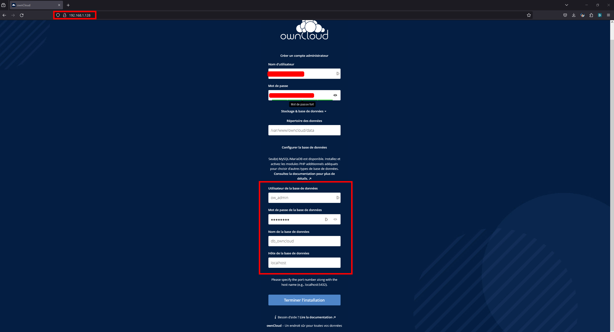
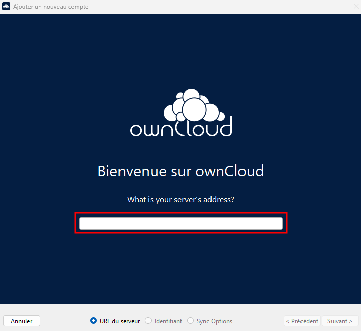

# DIY Home Server

Bienvenue dans le guide complet pour créer votre propre serveur à domicile en utilisant un NUC recyclé ou tout PC ayant une configuration similaire. Ce serveur polyvalent sera configuré avec Debian pour la virtualisation, l'hébergement web, un serveur VPN, et un serveur de fichiers.

## Table des matières

- [DIY Home Server](#diy-home-server)
  - [Table des matières](#table-des-matières)
  - [Prérequis](#prérequis)
  - [Spécifications Matérielles](#spécifications-matérielles)
  - [Proxmox](#proxmox)
    - [Téléchargement de Proxmox](#téléchargement-de-proxmox)
    - [Téléchargement de Rufus](#téléchargement-de-rufus)
    - [Création d'une clé USB bootable](#création-dune-clé-usb-bootable)
    - [Installation de Proxmox](#installation-de-proxmox)
    - [Configuration de Proxmox](#configuration-de-proxmox)
  - [Création d'une Machine Virtuelle sous Debian](#création-dune-machine-virtuelle-sous-debian)
  - [Installation d'OwnCloud Serveur](#installation-downcloud-serveur)
    - [Installation d'OwnCloud client](#installation-downcloud-client)
  - [Installation de OpenVPN](#installation-de-openvpn)
    - [Installation de OpenVPN Client](#installation-de-openvpn-client)
  - [Contributions](#contributions)
  - [Licence](#licence)

## Prérequis

Avant de commencer, assurez-vous de posséder des connaissances de base en matière de matériel informatique, de virtualisation, de systèmes Linux Debian, ainsi que de réseaux.

## Spécifications Matérielles
Configuration Minimale Recommandée :
- **Processeur (CPU) :**
    - Type : Processeur x86_64 (64 bits)
    - Cœurs : Quad-core
    - Fréquence : 2.0 GHz ou plus
    - Support de la virtualisation : Intel VT-x ou AMD-V

- **Mémoire (RAM) :**
    - Capacité : 8 Go
    - Type : DDR4
    - Fréquence : 2400 MHz ou supérieure

- **Stockage :**
    - Type : SSD
    - Capacité : 120 Go ou plus

- **Autres :**
    - Port USB : Pour l'installation depuis une clé USB

## Proxmox

### Téléchargement de Proxmox

1. Rendez-vous sur la page de téléchargement de [Proxmox](https://www.proxmox.com/de/downloads/proxmox-virtual-environment/iso/proxmox-ve-8-0-iso-installer) et téléchargez la version 8.0 ou ultérieure.

### Téléchargement de Rufus

1. Accédez à la page de téléchargement de [Rufus](https://github.com/pbatard/rufus/releases/download/v4.3/rufus-4.3.exe).

### Création d'une clé USB bootable

1. Insérez une clé USB (8 Go ou plus) dans votre ordinateur.
2. Lancez Rufus (précédemment téléchargé).
3. Dans Rufus, sous "Périphérique," sélectionnez votre clé USB.
4. Sous "Type de démarrage," cliquez sur le bouton "Sélection" et choisissez l'ISO de Proxmox que vous avez téléchargé précédemment.
5. Cliquez sur "Démarrer" pour créer la clé USB bootable. Ce processus effacera toutes les données sur la clé USB, assurez-vous d'avoir sauvegardé toutes les données importantes.

### Installation de Proxmox

1. Insérez la clé USB bootable dans l'ordinateur.
2. Démarrez l'ordinateur en vous assurant qu'il démarre à partir de la clé USB. Vous devrez peut-être modifier l'ordre de démarrage dans les paramètres du BIOS/UEFI.
3. Suivez les instructions à l'écran pour installer Proxmox.
4. Lors de la configuration du réseau, changez le nom d'hôte pour quelque chose comme "homeserver.gost.local."
5. Terminez le processus d'installation en suivant les invites.

Une fois Proxmox installé correctement et l'ordinateur redémarré, vous pouvez passer à l'étape de configuration.

### Configuration de Proxmox

1. Après le redémarrage de l'ordinateur, il devrait afficher son adresse IP.
2. Sur un autre ordinateur, saisissez l'IP dans le navigateur pour accéder à l'interface de Proxmox.
3. Ouvrez le shell du serveur, puis saisissez ces commandes :

   ```bash
   nano /etc/apt/sources.list.d/pve-enterprise.list
   ```

   **Remplacez :**

   ```bash
   bookworm
   ```

   **Par :**

   ```bash
   buster
   ```

   **À la fin, le fichier devrait ressembler à ceci :**

   ```bash
   deb https://enterprise.proxmox.com/debian/pve buster pve-enterprise
   ```

   **Puis :**

   ```bash
   nano /etc/apt/sources.list
   ```

   **Supprimez tout dans le fichier, puis collez ceci :**

   ```bash
   deb http://ftp.debian.org/debian bookworm main contrib
   deb http://ftp.debian.org/debian bookworm-updates main contrib

   # Proxmox VE pve-no-subscription repository provided by proxmox.com,
   # NOT recommended for production use
   deb http://download.proxmox.com/debian/pve bookworm pve-no-subscription

   # security updates
   deb http://security.debian.org/debian-security bookworm-security main contrib
   ```

   **Ensuite, mettez à jour Proxmox :**

   ```bash
   apt-get update && apt-get upgrade
   ```

## Création d'une Machine Virtuelle sous Debian

**Étape 1 : Téléchargement de l'image ISO de Debian**

1. Visitez le site officiel de Debian : [Debian](https://www.debian.org/)
2. Cliquez sur "Téléchargement" pour accéder à la page de téléchargement.
3. Lancez le téléchargement.

**Étape 2 : Création d'une machine virtuelle sur Proxmox**

1. Connectez-vous à l'interface web de Proxmox depuis un ordinateur.
2. Dans le volet de gauche, sélectionnez le nœud où vous souhaitez créer la machine virtuelle.
3. Cliquez sur "Créer VM" pour créer une nouvelle machine virtuelle.
4. Remplissez les informations requises, telles que le nom, le nœud, le type d'OS (Linux), et la version (Debian).
5. Spécifiez la quantité de mémoire RAM et la capacité de stockage.
6. Dans la section "CD/DVD", sélectionnez "Image ISO" et choisissez l'image ISO de Debian que vous avez téléchargée.
7. Cliquez sur "Créer" pour créer la machine virtuelle.

**Étape 3 : Configuration de l'installation de Debian**

1. Sélectionnez la machine virtuelle nouvellement créée.
2. Cliquez sur "Démarrer" pour lancer la machine virtuelle.
3. Cliquez sur "Console" pour accéder à la console de la machine virtuelle.

**Étape 3 : Installation de Debian**

1. Suivez les étapes d'installation de Debian via la console.
2. Choisissez la langue, le fuseau horaire, le clavier, et configurez le réseau.

   Lorsque vous atteignez la section des partitions, vous pouvez choisir d'utiliser l'ensemble du disque ou configurer les partitions manuellement selon vos besoins.
   
   Lorsque l'installation est terminée, retirez le support d'installation (l'image ISO) et redémarrez la machine virtuelle.

**Étape 4 : Configuration post-installation**

Connectez-vous à la machine virtuelle avec les identifiants que vous avez définis pendant l'installation.
1. Mettez à jour le système avec la commande : 
   ```bash
   sudo apt update && sudo apt upgrade
   ```
2. Installez les outils Proxmox en exécutant : 
   ```bash
   sudo apt install qemu-guest-agent pve-qemu-kvm
   ```
3. Redémarrez la machine virtuelle.

Votre machine virtuelle Debian sur Proxmox devrait maintenant être opérationnelle. N'oubliez pas de consulter la documentation officielle pour des configurations spécifiques ou des fonctionnalités avancées.

## Installation d'OwnCloud Serveur

**Étape 1 : Passer en utilisateur root**

Si vous n'êtes pas connecté en tant qu'utilisateur "root" au démarrage de la VM, vous pouvez le faire en vous déconnectant de la VM avec la commande :

```bash
exit
```

**Étape 2 : Télécharger les fichiers**

Créez un fichier temporaire :

```bash
mkdir tmp
```

Puis entrez dedans :

```bash
cd tmp
```

Clonez le dépôt :

```bash
git clone https://github.com/TheGostOfNight/DIY_Home_Server
```

**Étape 3 : Ajouter les permissions d'exécution au script**

```bash
chmod +x owncloud-install.sh
```

**Étape 4 : Lancement du script**

```bash
./owncloud-install.sh
```

**Étape 5 : Connexion à la page Web**

Pour accéder à l'interface web d'OwnCloud, trouvez d'abord l'adresse IP de la VM avec la commande :

```bash
ip addr
```

Dans un navigateur, saisissez l'adresse IP de la VM et remplissez les informations demandées.



**Étape 6 : Rendre accessible en ligne**

Pour cela, effectuez les modifications suivantes dans votre modem internet :
   - Port Web : 80
   - DynDNS : [no-ip](https://www.noip.com/)

### Installation d'OwnCloud client

**Étape 1 : Téléchargement du logiciel**

[Téléchargement ici](https://owncloud.com/desktop-app/)

**Étape 2 : Configuration du logiciel**

Si vous avez suivi l'étape pour rendre en ligne, lorsque vous devez saisir l'IP, vous devez écrire "http://cloud.noip.com/" sinon "http://votre_ip/"



Puis spécifiez votre utilisateur et les éléments à synchroniser.

## Installation de OpenVPN

**Étape 1 : Création de la VM**

Créez une nouvelle machine virtuelle comme [ici](#prérequis).

**Étape 2 : Passer en utilisateur root**

Si vous n'êtes pas connecté en tant qu'utilisateur admin "root" lors du démarrage de la VM, vous pouvez le faire en vous déconnectant de la VM avec la commande :

```bash
exit
```

**Étape 3 : Télécharger les fichiers**

```bash
curl -O https://raw.githubusercontent.com/angristan/openvpn-install/master/openvpn-install.sh
```

**Étape 4 : Ajouter les permissions d'exécution au script**

```bash
chmod +x openvpn-install.sh
```

**Étape 5 : Lancement du script**

Mode de choix des paramètres :

```bash
./openvpn-install.sh
```

Mode d'installation automatique :

```bash
AUTO_INSTALL=y ./openvpn-install.sh
```

**Étape 6 : Rendre accessible en ligne**

Pour cela, effectuez les modifications suivantes dans votre modem internet :
   - Port OpenVPN : 1194

### Installation de OpenVPN Client

**Étape 1 : Téléchargement de OpenVPN Community**

[Téléchargement ici](https://openvpn.net/community-downloads/)

**Étape 2 : Configuration de OpenVPN Community**

Le script d'installation d'OpenVPN a dû créer un fichier de configuration. Pour le copier facilement, vous pouvez vous connecter en SSH avec ce logiciel et récupérer le fichier de configuration à la racine de l'utilisateur root.

[Téléchargement ici](https://winscp.net/eng/index.php)

Une fois le fichier récupéré, vous pouvez le placer dans le logiciel OpenVPN et vous connecter.

Maintenant, vous pouvez vous connecter depuis n'importe où dans le monde tant que le PC reste allumé.

## Contributions 

Les contributions à ce projet sont les bienvenues. Si vous souhaitez contribuer, suivez ces étapes :

1. Clonez le référentiel.
2. Créez une nouvelle branche pour votre contribution.
3. Effectuez vos modifications et testez-les.
4. Soumettez une demande d'extraction (Pull Request) avec une description détaillée de vos modifications.

## Licence

Ce projet est sous licence [GNU General Public License]. Consultez le fichier LICENSE pour plus de détails.